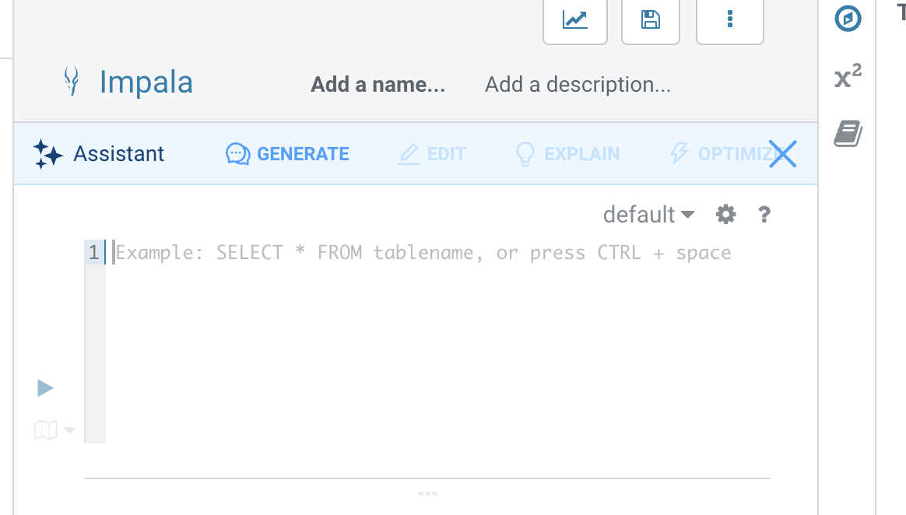

# 02_analyze

As part of the `Analyze` phase, we will run an interactive analysis of the data we brought in through a data pipeline into Cloudera's Data Lakehouse using Impala.

## Prerequisites

- Please ensure that you have completed [01_ingest](01_ingest.md#lab-2-create-an-open-data-lakehouse-powered-by-apache-iceberg) to ingest the data needed for analysis.

## Lab 1: Explore the Ingested Data

1. We will continue to analyze the data using Hue.
2. In the left pane, you will see a catalog of all the `databases` available. Click on `<prefix>_airlines`, where `<prefix>` is the prefix you used in the [ingest phase](01_ingest.md#lab-2-create-an-open-data-lakehouse-powered-by-apache-iceberg)
3. In the left pane, you will now see a list of all the `tables` ingested through your ETL/ELT pipeline in the [ingest phase](01_ingest.md#lab-2-create-an-open-data-lakehouse-powered-by-apache-iceberg)
4. You can now click on the table name to explore the schema of the table and run any sample queries to explore the dataset

## Lab 2: Build Business Intelligence Reports

We will now run interactive queries to build Business Intelligence (BI) reports. The business wants to build a Passenger Manifest and Layover Reporting dashboard to get actionable insights out of the data.

Cloudera offers a powerful tool called the Hue SQL AI Assistant, which can automatically generate SQL queries from natural language. In this tutorial, we'll learn how to leverage it to make insightful predictions.

1. Click on Editor > Impala to go to your interactive editor.
   
2. On the top left click on the `Assistant`.
3. Enter the below text queries and click `Generate` to get the SQL queries generated automatically.
   

- The Data Lake house that was created in the [ingest phase](01_ingest.md#lab-2-create-an-open-data-lakehouse-powered-by-apache-iceberg) phase can answer many different questions to solve business problems, such as:
     1. Which Routes (origin airport to destination airport) have the highest average flight delays?  This can be used to assist in determining which Routes to concentrate resources to decrease the chance of delay.
     2. Which Carriers (airlines) have the highest percentage of cancelled flights?  This can be used to see if certain Carriers are outside the normal cancellation percentage and if so this information can help determine which Carrier to fly or not fly.
     3. Which Carriers should we partner with to offer coupons to Passengers on International flights with long layovers in order to help drive additional purchases at our Duty-Free stores?
     4.  Average duration of domestic flights in the USA.
     5. Model names of Boeing plains that flew from 1990 to 2000.
     6. Number of Airbus planes that operated in the USA in 1995.
- Execute each of the SQL queries generated from NQL to answer these burning business questions - 

Now that we know we can answer many burning business questions with this data, we need to get the analytic power into the hands of our Business Users.  Since they are not as familiar with writing complex SQL, we need to give them visualizations of the data so they can discover insights from the data.

We are now ready to [Predict](04_predict.md#04_predict) the likelihood of a flight being canceled.
